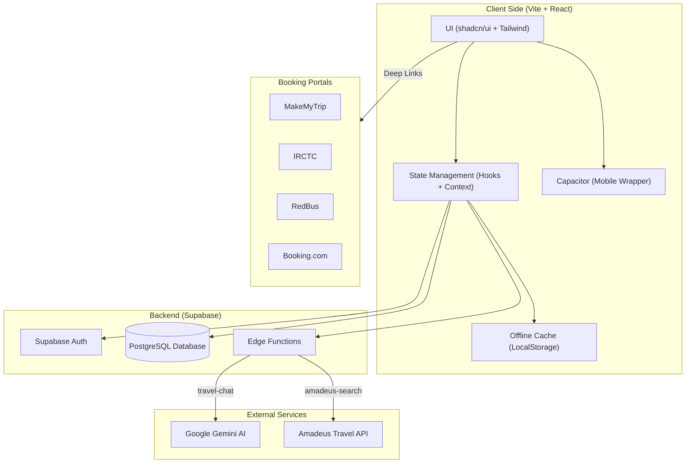

# WanderWise Assistant: GenAI-Powered Virtual Travel Agent Copilot

WanderWise Assistant is a modern, AI-driven copilot designed to empower travel agents and individuals with instant, personalized travel planning. By leveraging Large Language Models (LLMs) and real-time travel APIs, it reduces manual research time by up to 60%, providing data-backed itineraries in seconds.

## 🌟 Key Features

### 🤖 AI-Powered Travel Chat
- **Intelligent Recommendations:** Powered by Google Gemini 1.5/2.0/3.0 Flash (via Lovable AI Gateway), providing contextual travel advice and multi-scenario itineraries.
- **Preference-Driven:** An intuitive "Budget vs. Comfort" tradeoff slider (0-100%) ensures the AI respects specific client constraints.
- **Multi-Modal Support:** Support for **Plane**, **Train**, and **Bus** travel modes with mode-specific restrictions and booking links.
- **Local Context & Explainability:**
  - **Explainable AI:** Confidence scores and risk assessments (e.g., tight connections, price volatility).
  - **Local Amenities:** Automatically identifies nearest hospitals and recommended cafes for suggested stays.
  - **Booking Tips:** Contextual advice on cancellation policies and insurance.

### 🗺️ Multi-Scenario Itineraries
- **Three-Tier Options:** Automatically generates **Budget**, **Balanced**, and **Comfort** scenarios for every search.
- **Real-Time Data:** Integrates with **Amadeus Travel API** for live flight pricing and availability.
- **Direct Booking:** One-click links to **MakeMyTrip**, **IRCTC**, **RedBus**, and **Booking.com**.

### 💼 Travel Agent Dashboard
- **Customer Management:** Maintain detailed client profiles and travel preferences.
- **Conversation History:** Persisted chat history in Supabase to manage multiple ongoing client inquiries.
- **Message Templates:** Reusable templates for confirmations, reminders, and visa notifications.
- **Booking Checklist:** Integrated task management for flights, hotels, visas, and insurance.

### 🌐 Global & Resilient
- **Multilingual Support:** Supports 20+ languages including English, Hindi, Marathi, Gujarati, Bengali, Tamil, Telugu, and more.
- **Offline Mode:** Robust offline support with local data caching (`useOfflineCache`) and real-time connectivity indicators.
- **Mobile Ready:** Built with Capacitor for seamless iOS and Android deployment.

## 🚀 User Journey

1.  **Authentication:** Secure login via Supabase Auth.
2.  **Onboarding:** Selection of preferred language and primary travel mode.
3.  **Discovery:** AI-driven chat for trip planning with real-time flight/hotel search.
4.  **Refinement:** Adjustment of "Budget vs. Comfort" preferences.
5.  **Selection:** Comparison of Budget, Balanced, and Comfort scenarios.
6.  **Finalization:** Management of booking checklists and communication templates.

## 🏗️ Technical Architecture



- **Frontend:** React 18 (Vite), TypeScript, Tailwind CSS, shadcn/ui.
- **Backend:** Supabase (Auth, Postgres, Edge Functions).
- **AI Orchestration:** Supabase Edge Functions calling Gemini 1.5/2.0/3.0 Flash.
- **APIs:** Amadeus Travel API for live data.
- **Persistence:** Postgres (Conversations/Customers) + LocalStorage (Offline Cache).
- **Mobile:** Capacitor (iOS/Android).

## 🛠️ Setup & Installation

### Prerequisites
- Node.js (v18+)
- Supabase account & CLI

### Installation

1.  **Clone & Install:**
    ```bash
    git clone https://github.com/your-repo/wanderwise-assistant.git
    cd wanderwise-assistant
    npm install
    ```

2.  **Environment Setup:**
    Create a `.env` file:
    ```env
    VITE_SUPABASE_URL=your_supabase_url
    VITE_SUPABASE_ANON_KEY=your_supabase_anon_key
    VITE_GEMINI_API_KEY=your_gemini_api_key
    ```

3.  **Supabase Configuration:**
    - Run migrations in `supabase/migrations`.
    - **Set Edge Function Secrets:**
      ```bash
      supabase secrets set AMADEUS_CLIENT_ID=your_id
      supabase secrets set AMADEUS_CLIENT_SECRET=your_secret
      supabase secrets set LOVABLE_API_KEY=your_key
      ```
    - **Deploy Functions:** `supabase functions deploy travel-chat` and `amadeus-search`.

4.  **Run Development:**
    ```bash
    npm run dev
    ```

## 🧪 Testing
```bash
npm run test # Runs Vitest
```

## 📄 License
MIT License.

---
*Built for the GenAI Travel Hackathon.*
